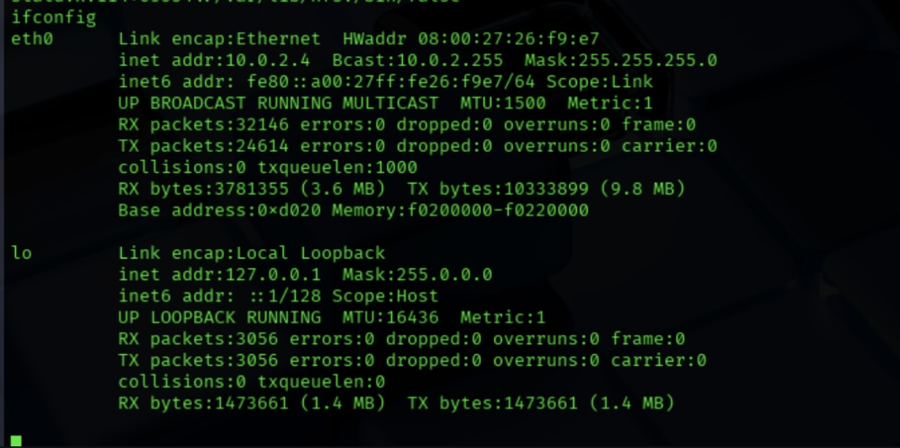
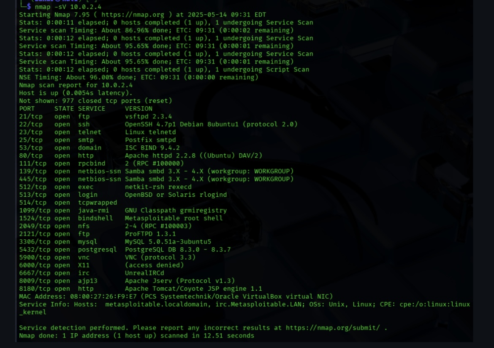
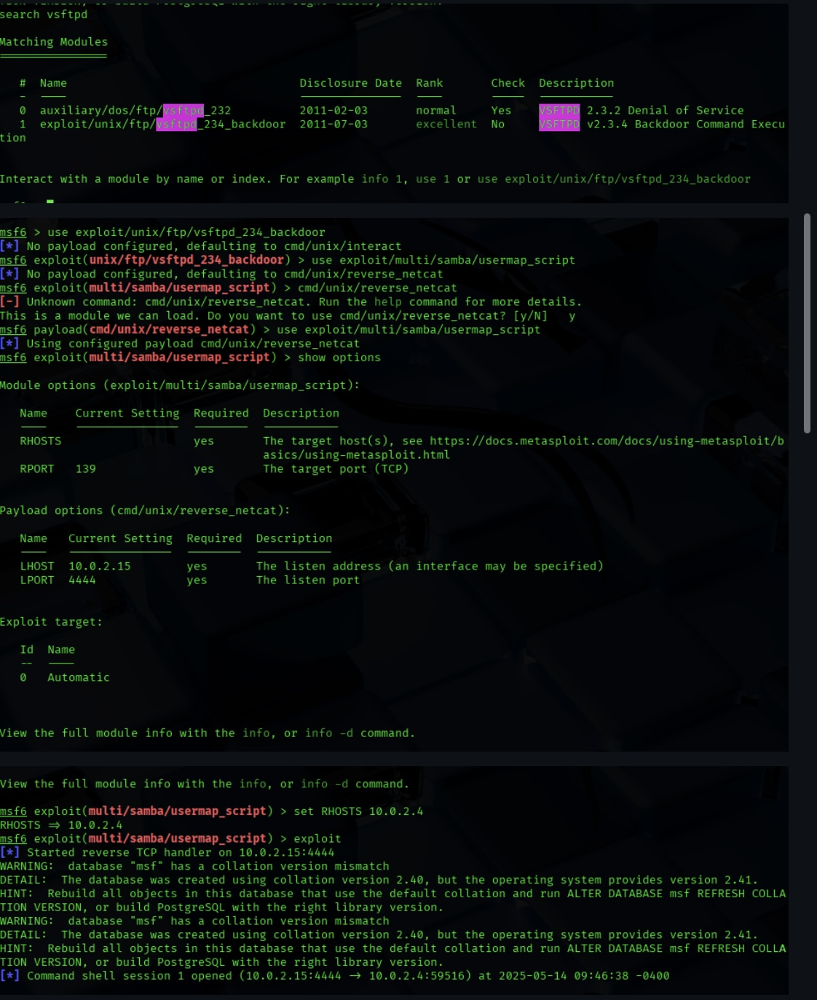
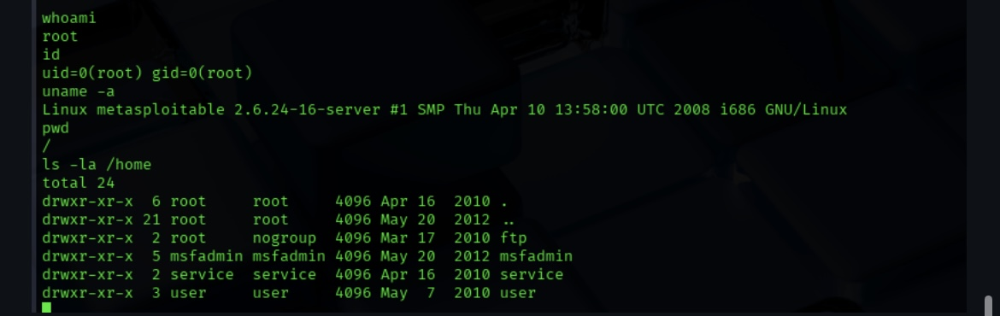
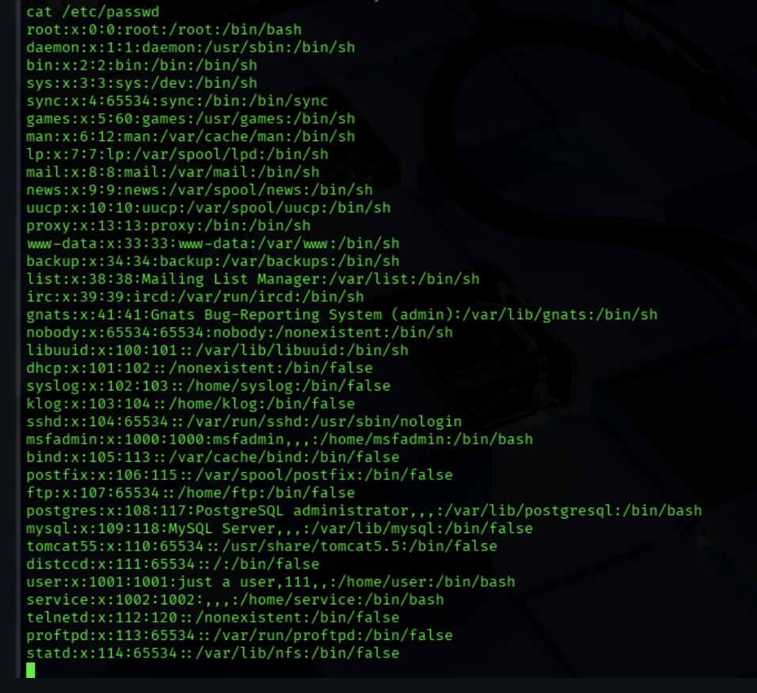
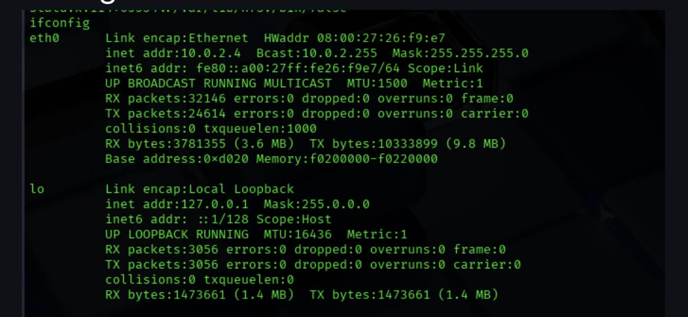
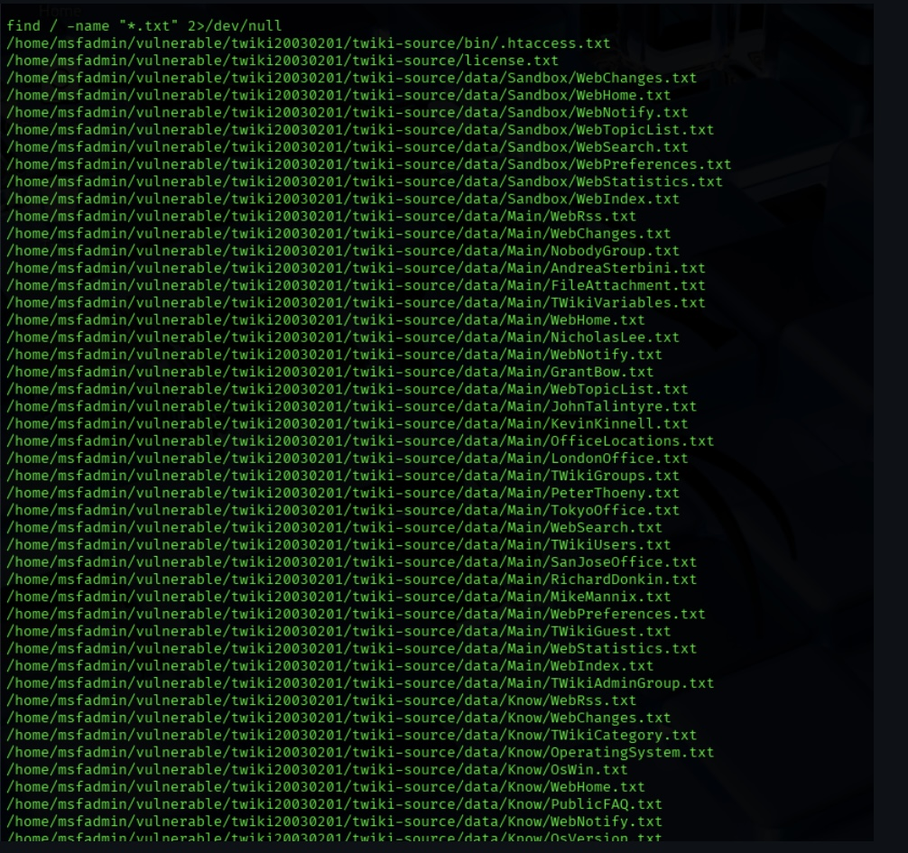
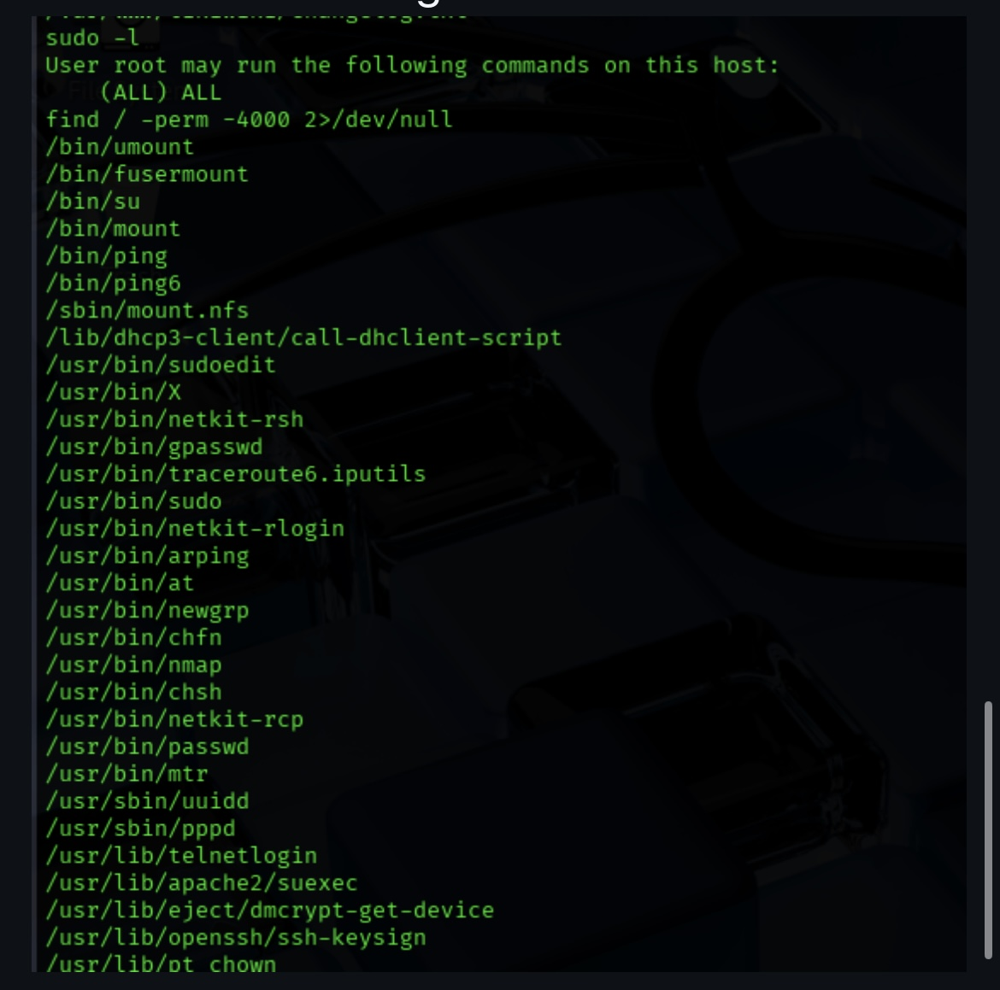
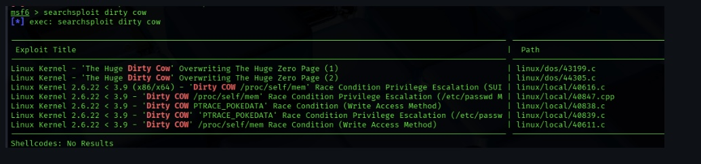
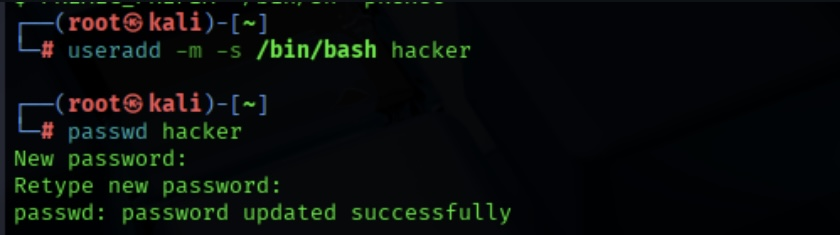

# ip target

# scanning

# finding weak services

# shell

# post exploitation

# configuration the network

# files

# privalage escalation

# suid files
IMG_1934.jpeg
# exploit

# persistence

