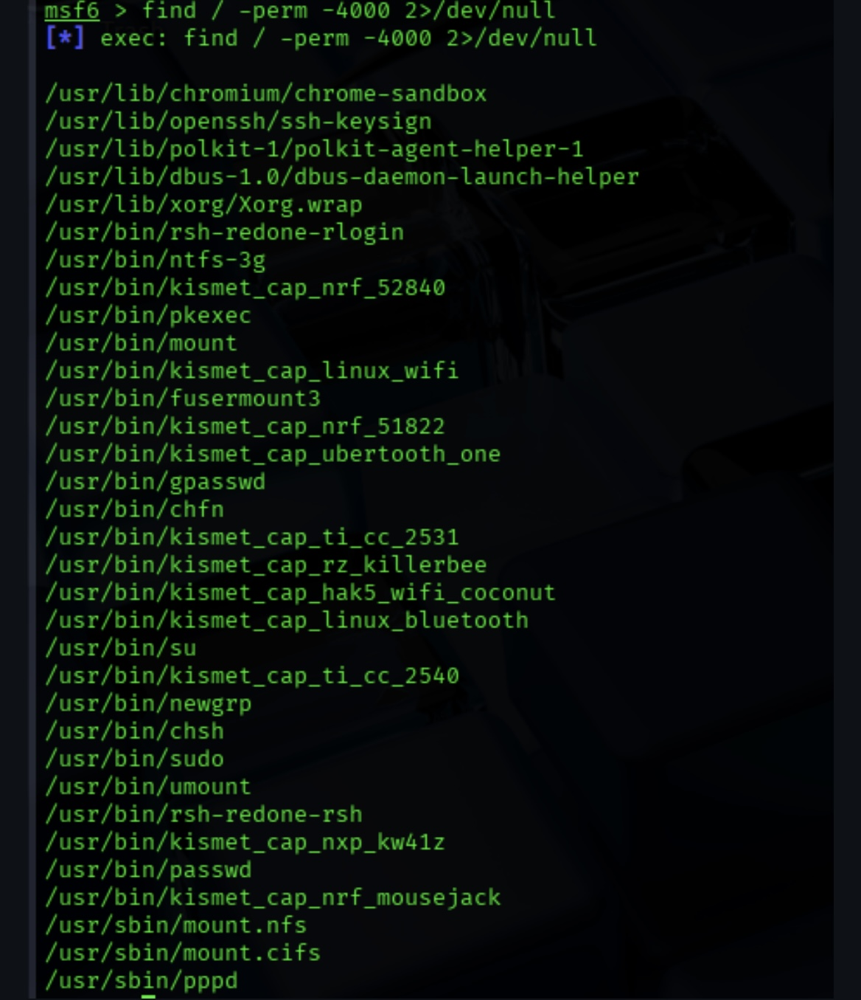

# ip target

# scanning

# finding weak services

# shell

# post exploitation

# configuration the network

# files

# privalage escalation

# suid files

# exploit

# adding user

# deleting bash history

# deleting log files

